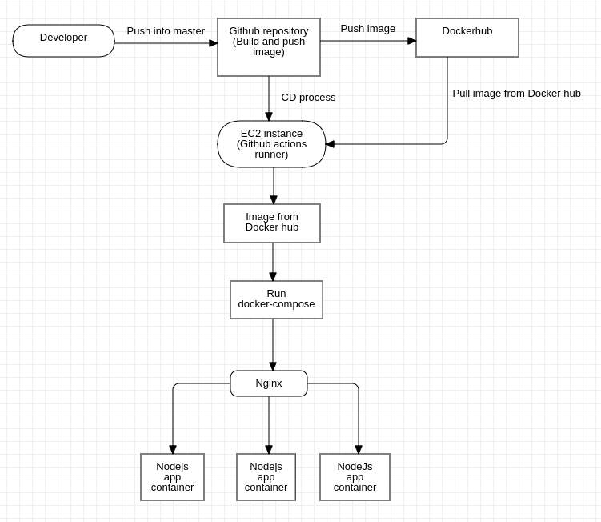

# Golden Owl DevOps Internship - Technical Test

My reposiroty for the Technical Technical from Golden Owl

## Authors

- [Nguyen Minh Phat](https://github.com/phatnguyen138)

## Overview 
### CI: 
- Use Github actions to build image from source code, then push into Docker hub

### CD: 
- Use EC2 instance as Github actions runner, then pull image from Docker hub, use docker-compose to run app as containers

### Load balancing:
- Use nginx at port 80 to redirect request into 3 Nodejs instances

## Deployment

Project is deployed into AWS EC2.

Link: [http://ec2-13-213-15-229.ap-southeast-1.compute.amazonaws.com/](http://ec2-13-213-15-229.ap-southeast-1.compute.amazonaws.com/)

## Workflow:

